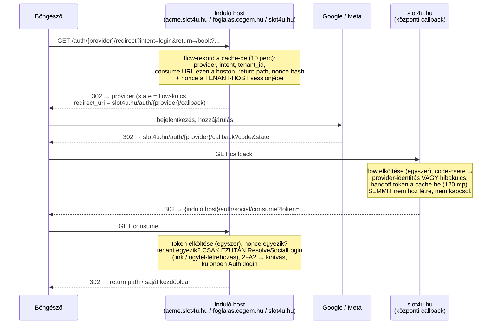

# 28 — Social login: Google + Facebook

**Issue:** SLO-250 (epik) → SLO-251 (mag, ez a doksi első változata), SLO-252 (foglalási flow, profil, FB e-mail nélkül), SLO-253 (Meta data-deletion).
**Csomag:** `laravel/socialite`.

## 1. A probléma, amit az architektúra megold

A Google és a Meta **csak pontosan regisztrált redirect URI-t** fogad el. Wildcard (`*.slot4u.hu`) nem regisztrálható, és egy tenant saját domainje (`foglalas.cegem.hu`) sem. Közben a belépésnek azon a hoston kell létrejönnie, ahol a látogató van: a saját domain **külön sessiont** kap (docs/01, „Egyedi tenant-domain”), oda a központi domainen létrehozott session el sem jutna.

Ezért a folyamat három hoston át megy, és két rövid életű, egyszer használható kulcs viszi:



| Végpont | Hol | Route név |
|---|---|---|
| `GET /auth/{provider}/redirect` | központi domain + tenant hostok (saját domainen a host-átírással) | `social.redirect`, `tenant.social.redirect` |
| `GET /auth/{provider}/callback` | **csak** a központi domain | `social.callback` |
| `GET /auth/social/consume` | központi domain + tenant hostok | `social.consume`, `tenant.social.consume` |

Az admin panel hostján (`admin.slot4u.hu`) egyik sincs, és a login oldal nem is kínál gombot: a superadmin csak jelszóval + 2FA-val léphet be.

Kód: `App\Http\Controllers\Auth\Social{Redirect,Callback,Consume}Controller`, `App\Services\SocialAuth\*` (`SocialAuthBroker` = flow és token, `SocialAuthUrls` = callback URI, felkínált providerek, return path), `App\Actions\SocialAuth\ResolveSocialLogin`.

## 2. Biztonsági döntések

### 2.1 A flow az induló hoston kezdődik (eltérés a SLO-250 leírásától)

A brief szerint a központi domain adná az indító végpontot, a tenant és a return URL paraméterként érkezne, a return URL-t pedig host-allowlistával kellene ellenőrizni. Ehelyett **az induló host maga hozza létre a flow-t**, ezért:

- **Open redirect nem validációs kérdés, hanem kifejezhetetlen.** A cél-host a flow-rekordba írt consume URL (`url()`, tehát saját domainen a látogató hostja), a return csak **relatív útvonal** lehet (`SocialAuthUrls::safeReturnPath`: nincs séma, host, `//`, `\`, vezérlőkarakter, és nem `/auth/...`). Nincs allowlist, amit el lehetne rontani.
- **Login-CSRF védelem.** A consume csak akkor vált be tokent, ha a böngésző sessionjében ott a flow indításakor írt nonce. Enélkül egy támadó a saját Google-fiókjával végigjátszott flow consume-linkjét elküldhetné valakinek, aki így a *támadó* fiókjába lépne be (és ott foglalna, adatot adna meg).
- **A callback nem dönt és nem ír.** A callback nem tudja, kinek a böngészőjével beszél: a támadó a saját redirectjéből kimásolt provider-URL-t (benne a `state`-tel) elküldheti valakinek, aki a Google-nél belép. Ha a callback már itt létrehozná az ügyfelet vagy kapcsolná az identitást, az áldozat e-mailje a támadó választotta tenantnál kötne ki (és a globális e-mail-egyediség miatt máshol nem is regisztrálhatna). Ezért a callback csak a code-cserét végzi, a `ResolveSocialLogin` — minden írás — a consume-ban fut, a nonce- és tenant-ellenőrzés **után** (a SLO-251 biztonsági review lelete, teszt: „creates and links nothing for a callback that reaches a browser which did not start the flow”).
- **Tenant-kötés.** A `.slot4u.hu` session az aldomének között közös, ezért az *A* tenanton indított token a *B* tenant hostján is látná a nonce-t. A consume ezért a flow `tenant_id`-ját is összeveti az aktuális tenanttal.

A szerep-kontextust sem a kliens adja (`SocialIntent` = `login | booking`, nem szerepkör): lásd §3.

### 2.2 Egyszeri használat, rövid élet

| Kulcs | Élettartam | Hol él |
|---|---|---|
| flow-kulcs (OAuth `state`) | 10 perc (`FLOW_TTL_SECONDS`) | cache, sha256-kulccsal |
| handoff token | 120 mp (`HANDOFF_TTL_SECONDS`) | cache, sha256-kulccsal |
| nonce | a flow-ig, sessionönként max. 5 nyitott flow | az induló host sessionje |

⚠️ Az „egyszer” egy `Cache::add(...:spent)` marker, nem `Cache::pull`: a prod cache store az adatbázis, ahol a get+delete két utasítás (két párhuzamos kérés mindkettő megkaphatná az értéket), az `add` viszont egyetlen atomi insert (Redisen `SET NX`).

Rate limit: `throttle:social` — 20/perc IP-nként mindhárom végponton (IP és nem host szerint, mert a lépések különböző hostokon futnak).

### 2.3 Egy provider-belépés első faktor

Ha a fióknak be van kapcsolva a 2FA, a consume nem léptet be, hanem a Fortify saját átadását csinálja (`login.id` a sessionbe → `/two-factor-challenge`), pontosan úgy, ahogy a jelszavas belépés.

### 2.4 Tokent nem tárolunk

A Socialite által visszaadott access/refresh token a `SocialIdentity` DTO-ban eldobódik. A provider API-ját nem hívjuk a user nevében, csak azonosítunk.

## 3. Kit léptet be, kit hoz létre (`ResolveSocialLogin`)

Sorrendben — a sorrend maga a biztonsági modell:

1. **Már kapcsolt identitás** (`social_accounts` provider + provider_user_id) → az a user. A tárolt szolgáltatói profil frissül.
2. **Nincs e-mail** (Facebook telefonos fiók) → `no_email` hiba. Az e-mail bekérő + megerősítő lépés az SLO-252.
3. **A provider nem vállalja az e-mailt** → `email_unverified`. Google: `email_verified`. Facebook: csak megerősített címet ad vissza, ezért a meglévő cím verifikáltnak számít (Daniel döntése, SLO-250).
4. **Verifikált e-mail egyezik egy fiókkal** → kapcsolás + belépés, szerepkörtől függetlenül (admin, staff, ügyfél).
   - ⚠️ **Pre-hijack:** ha a fiók e-mailje *sosem volt megerősítve*, a kapcsoláskor a jelszó `NULL` lesz, a `remember_token` és minden session törlődik. Aki a más e-mailjével előre regisztrált, nem marad bent. (Meghívott staffnál az e-mail a meghíváskor verifikált, őket ez nem érinti.)
   - Ha a fióknak már van **másik** identitása ugyanennél a providernél → `not_available` (a csendes csere a fiókot adná át).
5. **Nincs fiók**
   - központi domainen → `no_account`. Céget az űrlap regisztrál, nem egy Google-fiók.
   - tenant hoston → **ügyfél** jön létre (`CreateCustomer`, `passwordless`, `email_verified_at` = most). Semmilyen input nem kér szerepkört, tehát social úton **tenant-admin vagy staff fiók nem hozható létre** — staff csak azért létezik, mert valaki jogosult létrehozta.

**Mindig elutasítva, semleges üzenettel (`not_available`):** superadmin, anonimizált fiók, és tenant hoston **másik tenant usere**. Az e-mail globálisan egyedi (egy e-mail = egy user = egy tenant), így ugyanaz a Google-fiók két cégnél nem lehet ügyfél. A semleges üzenet azért kell, hogy a gomb ne árulja el, van-e fiókja valakinek egy másik cégnél. A foglalási flow-ban ilyenkor belépés nélküli vendég-előtöltés jön (SLO-252).

Új ügyfélnél a jogi dokumentumok elfogadását **nem** a social flow kéri: az `EnsureLegalConsent` az első védett kérésnél a `/consent` oldalra viszi, mint minden el nem fogadott verziónál (docs/19 §10.5).

## 4. Jelszó nélküli fiókok

- `users.password` nullable. A `NULL` jelszavú fiókra a jelszavas login **nem hash-összehasonlítást** csinál (`Fortify::authenticateUsing`), hanem saját üzenetet ad (`auth.social_only`) — ⚠️ **de csak az adott tenant host saját userének.** Az e-mail-keresés platformszintű, ezért másik tenant userére és a központi domainen az általános `auth.failed` jön, különben bármelyik login form elárulná, hogy egy cím valahol Google/FB-bel regisztrált. Nem létező e-mailre és rossz jelszóra a válasz változatlanul `auth.failed`.
- Az `AuthenticateSession` a jelszó nélküli usert kihagyja (keretrendszer-viselkedés), a „kilépés máshonnan jelszóváltáskor” így nem értelmezett rájuk.
- Jelszót a „Elfelejtetted a jelszavad?” úton bármikor beállíthat. A `/my/profile` „jelszó beállítása” (jelenlegi jelszó nélkül) az SLO-252.
- Az anonimizálás továbbra is **véletlen** jelszót ír, nem `NULL`-t (docs/19 §3.2).

## 5. Adatmodell és GDPR

`social_accounts` — docs/02. `BelongsToTenant` (a callback tenant nélkül fut, ott a scope no-op; a lekérdezések ettől függetlenül `withoutGlobalScopes`-szal, explicit feltétellel mennek).

- **Export:** `subject.linked_accounts` (provider, provider_user_id, email, név, avatar, kapcsolás ideje).
- **Törlés/anonimizálás:** a sorok törlődnek (`AnonymizeUserProfile`), a sweep-teszt ezt ellenőrzi.
- **Tenant-purge:** az anonimizáláson át, és FK-cascade a tenantra.

## 6. Konfiguráció

### 6.1 `.env`

```
GOOGLE_CLIENT_ID=
GOOGLE_CLIENT_SECRET=
FACEBOOK_CLIENT_ID=
FACEBOOK_CLIENT_SECRET=
```

Ha egy providernél bármelyik üres, az a provider **ki van kapcsolva**: nincs gomb, a végpontjai 404-et adnak. Dev és CI így kulcs nélkül is működik.

A redirect URI-t **nem** kell env-ben megadni: mindig `{APP_URL sémája}://{APP_CENTRAL_DOMAIN}/auth/{provider}/callback` (`SocialAuthUrls::callback`).

### 6.2 Google Cloud Console

1. APIs & Services → OAuth consent screen: External, app neve „slot4u”, támogatási e-mail, **Authorized domains:** `slot4u.hu`, adatvédelmi és ÁSZF link. Scope-ok: `openid`, `email`, `profile` (nem érzékenyek, nem kell hitelesítési eljárás).
2. Credentials → Create OAuth client ID → **Web application**.
3. **Authorized redirect URIs:** `https://slot4u.hu/auth/google/callback`. (Authorized JavaScript origins nem kell.)
4. A kapott Client ID / Client secret → a szerver `.env`-je.
5. Amíg a consent screen „Testing” módban van, csak a felvett tesztfelhasználók léphetnek be → élesítés előtt „In production”.

### 6.3 Meta for Developers

1. Create app → „Authenticate and request data from users with Facebook Login”.
2. Facebook Login → Settings: **Valid OAuth Redirect URIs:** `https://slot4u.hu/auth/facebook/callback`; Client OAuth login és Web OAuth login bekapcsolva, „Enforce HTTPS” be.
3. App settings → Basic: **App Domains:** `slot4u.hu`, Privacy Policy URL, Terms URL, kategória, ikon; az App ID / App secret → a szerver `.env`-je.
4. Permissions: `email`, `public_profile` (alapból elérhetők, App Review nem kell hozzájuk).
5. **User data deletion:** a „Data deletion callback URL” az SLO-253 végpontja lesz (`https://slot4u.hu/auth/facebook/data-deletion`). **Enélkül az app nem kapcsolható Live módba**, addig csak az app szerepkörrel rendelkező (admin/developer/tester) fiókok léphetnek be.

### 6.4 Lokális fejlesztés

A Google `http://` redirect URI-t csak `localhost`-ra fogad el, a `slot4u.test` nem regisztrálható. A lokális ellenőrzés ezért a Pest-tesztekre támaszkodik (`Socialite::fake`, minden más valódi: flow, nonce, token, feloldás). Valódi végponttól-végpontig próba élesben vagy stagingen (SLO-156).

## 7. Deploy (Tárhely.Eu)

- A `composer.lock` változik (Socialite) → a `deploy.sh` futtat `composer install --no-dev`-et. A Socialite `require`, nem `require-dev`.
- Két migráció: `social_accounts` létrehozása, `users.password` nullable.
- A kulcsokat a **szerver** `.env`-jébe kell írni (`~/slot4u/.env`), utána `php artisan optimize:clear` (ea-php84: `/opt/cpanel/ea-php84/root/usr/bin/php`), mert a config cache-elt.
- Kulcs nélkül a release biztonságos: a gombok egyszerűen nem jelennek meg.

## 8. Tesztek

`tests/Feature/Auth/SocialLoginTest.php` — ügyfél-regisztráció, e-mail link, két provider = egy user, kapcsolt identitás e-mail-váltás után, admin/staff belépés, **admin/staff létrehozás tiltása** (központi domain, szerep-paraméter), superadmin tiltás, admin host, 2FA, verifikálatlan e-mail, FB e-mail nélkül, másik tenant usere, pre-hijack, megszakított hozzájárulás, lejárt/újrajátszott state, konfigurálatlan provider, felfüggesztett tenant, **token egyszeri használat, lejárat, login-CSRF, tenant-csere**, return path (adatkészlettel), saját domain, jelszó nélküli login-üzenet, tenant-izoláció, felkínált gombok. Export: `MyPrivacyTest`, törlés: `PersonalDataErasureTest` (sweep).

A biztonsági ágak mindegyikén mutációs próba futott: a feltétel kikapcsolására a hozzá tartozó teszt pirosra vált.
